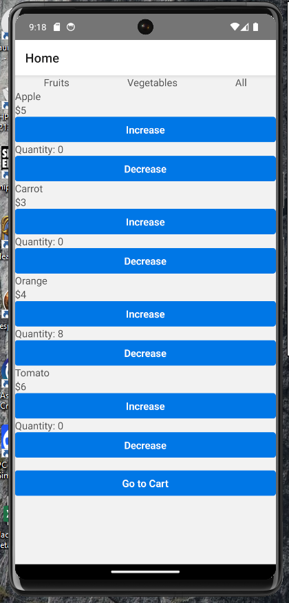
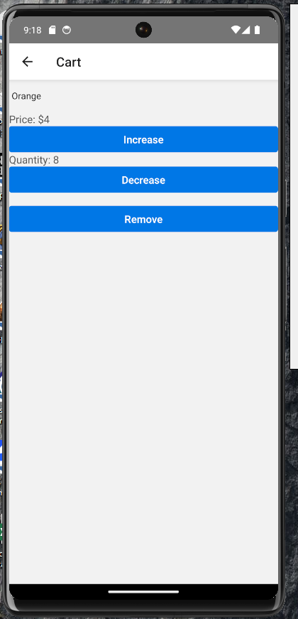

# Grocery List App

This is a React Native application for managing a grocery list.
## Screens





## Features

- View grocery list
- Add amounts to each item in the list
- Mark items as bought
- Filter items by category (e.g., Fruits, Vegetables)
- Add items to the cart and change their quantities
- Change the name of items in the cart without affecting the grocery list
- Remove items from the cart

## Technologies Used

- React Native
- TypeScript
- Redux Toolkit
- React Query (TanStack Query)
- JSON Server (for mocking API)
- Gluestack (for UI components)

## Setup


### Installation

1. Clone the repository:
    ```sh
    git clone https://github.com/yourusername/grocery-list-app.git
    cd grocery-list-app
    ```

2. Install dependencies:
    ```sh
    npm install
    ```

3. Start JSON Server:
    ```sh
    npm run server
    ```

4. Start the React Native app:
    ```sh
    npm start
    ```

